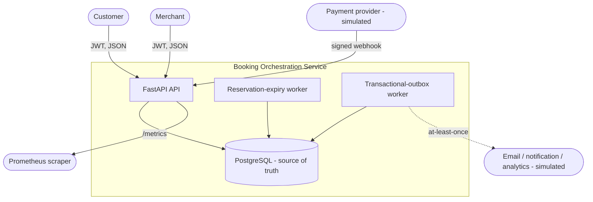
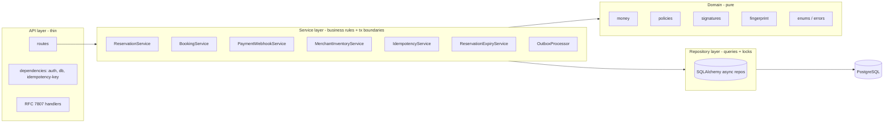
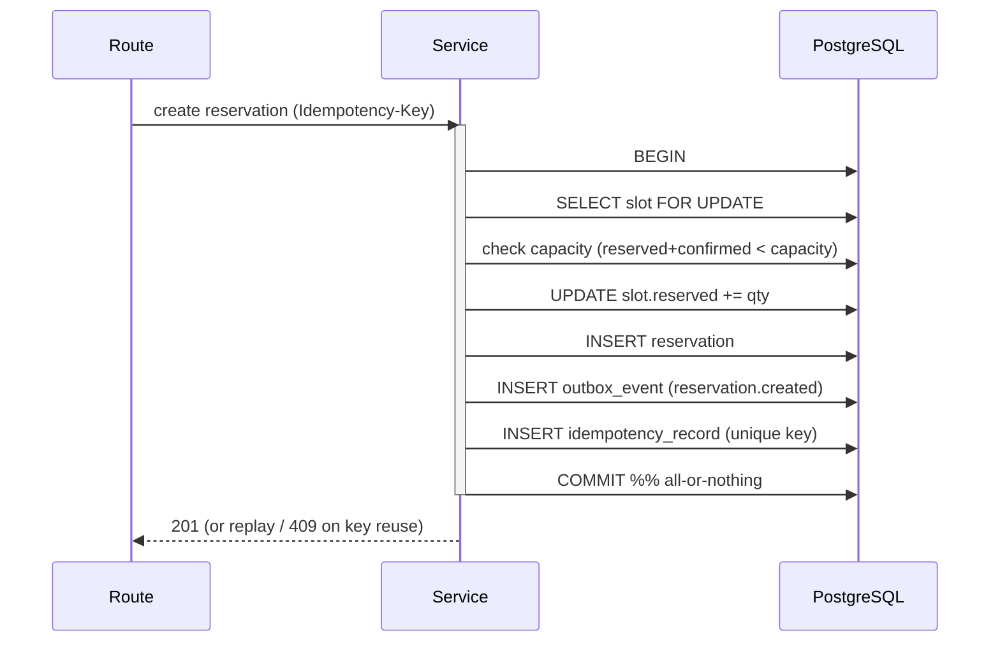

# Architecture

Independent educational portfolio project. Not affiliated with Klook.

## System context

## Component responsibilities

| Layer | Responsibility | Does **not** |
|-------|----------------|--------------|
| Routes | Auth, parse/validate input, call a service, shape response | Contain business rules |
| Services | Enforce invariants, own the transaction, emit outbox events | Import HTTP/Starlette types |
| Repositories | Encapsulate queries and locking (`FOR UPDATE [SKIP LOCKED]`) | Contain business rules |
| Domain | Pure functions: money, policies, signatures, fingerprints | Touch I/O or the framework |
| Models | ORM mapping + DB constraints | Leak into API responses (DTOs are separate) |

## Transaction boundaries

Each mutating use case is **one** database transaction that commits the business
state change, the inventory mutation, **and** the outbox event together.

If anything fails — including the idempotency unique violation from a concurrent
duplicate — the **entire** transaction rolls back, so no partial inventory change
or orphan event can persist.

## Scaling considerations

- **API** is stateless → scale horizontally behind a load balancer.
- **PostgreSQL** is the correctness bottleneck. Inventory writes serialize per
  *slot* (row lock), not globally, so throughput scales with the number of
  distinct hot slots. Reads scale with replicas + caching.
- **Workers** scale horizontally: `FOR UPDATE SKIP LOCKED` lets N instances claim
  disjoint batches. Idempotent consumers absorb the outbox's at-least-once
  delivery.
- Hot single-slot contention (one flash-sale slot) is the natural limit; options
  include sharded counters or queueing, deliberately out of scope here.

## Failure modes

| Failure | Behaviour |
|---------|-----------|
| Duplicate reservation request (same key) | Replays stored response; no double hold |
| Concurrent duplicate (same key, in-flight) | Unique constraint → loser rolls back, replays winner |
| Inventory exhausted | Deterministic `409 inventory_unavailable` |
| Reservation expires during confirm | Confirm blocks on the lock, then sees `expired` → `409` |
| Webhook replayed | Unique `event_id` → safe `200 duplicate` |
| Bad webhook signature / stale timestamp | `401` / `400`, counted in metrics, secret never logged |
| Worker crash mid-batch | Uncommitted batch rolls back; rows unlock; retried next poll |
| DB down | `/health/ready` returns 503; requests fail cleanly with RFC 7807 |
| Unexpected exception | Logged with traceback server-side; client gets opaque `500` |

## Trade-offs

- **Modular monolith over microservices** — one deployable, one database, local
  transactions. Simpler and correct for this scope (see ADR-0002).
- **Pessimistic row locks over optimistic retries** — simpler reasoning and no
  client-visible retry storms for the hot path; a `version` column is kept for
  optimistic checks where useful (ADR-0004).
- **Transactional outbox over dual-writes** — avoids the "wrote to DB but not to
  the bus" inconsistency, at the cost of at-least-once delivery (ADR-0003).
- **psycopg3 for both async app and sync Alembic** — one driver, one URL.

See [ADRs](ADRS/) for the recorded decisions.
