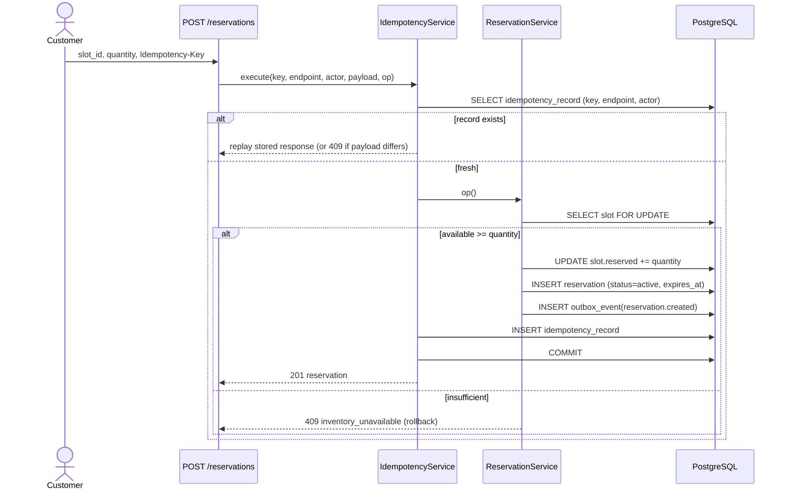
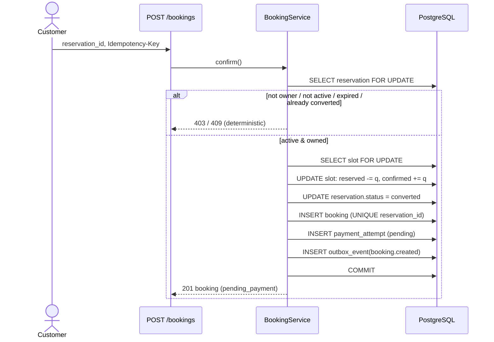
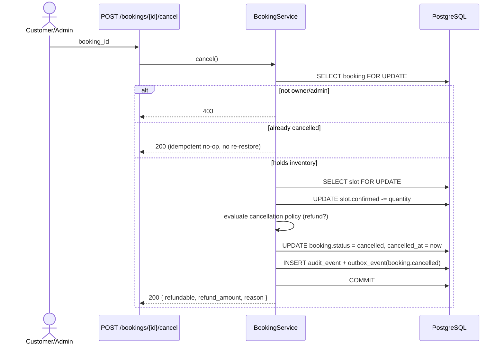
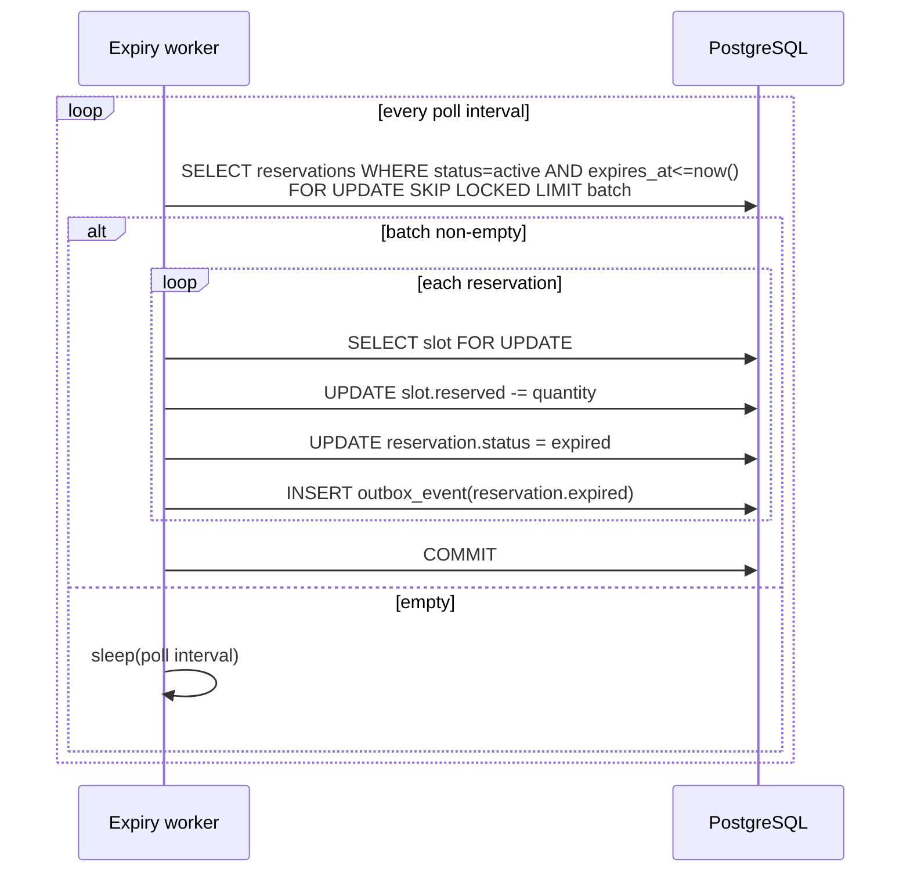

# Booking Sequence Diagrams

Independent educational portfolio project. Not affiliated with Klook.

## 1. Reservation creation (idempotent, concurrency-safe)



## 2. Booking confirmation (reserved → confirmed, one per reservation)



## 3. Payment webhook (HMAC + replay window + dedup + amount match)

```mermaid
sequenceDiagram
    participant P as Payment provider (simulated)
    participant API as POST /webhooks/payments
    participant PS as PaymentWebhookService
    participant DB as PostgreSQL

    P->>API: raw body + X-Webhook-Signature + X-Webhook-Timestamp
    API->>PS: process(raw_body, timestamp, signature)
    PS->>PS: verify HMAC (constant-time)
    alt bad signature
        PS-->>API: 401 invalid_webhook_signature
    else timestamp outside window
        PS-->>API: 400 webhook_timestamp_out_of_window
    else valid
        PS->>DB: SELECT payment_attempt WHERE event_id = ?
        alt already seen
            PS-->>API: 200 duplicate (no-op)
        else new
            PS->>DB: find booking by provider_reference; SELECT booking FOR UPDATE
            alt amount/currency mismatch
                PS-->>API: 409 payment_amount_mismatch
            else match & succeeded
                PS->>DB: INSERT payment_attempt(event_id UNIQUE, succeeded)
                PS->>DB: UPDATE booking.status = confirmed
                PS->>DB: INSERT outbox_event(booking.confirmed)
                PS->>DB: COMMIT
                PS-->>API: 200 processed
            end
        end
    end
```

## 4. Cancellation (idempotent, restores inventory exactly once)



## 5. Reservation expiry (background worker, batched, safe for parallel workers)


