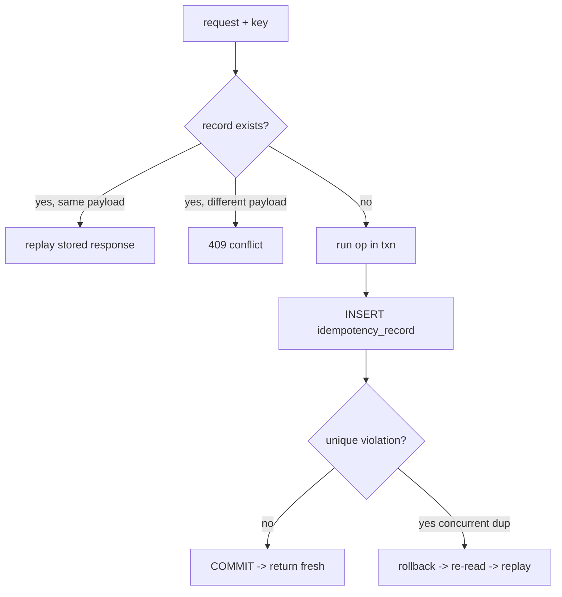

# Concurrency & Idempotency Design

Independent educational portfolio project. Not affiliated with Klook.

This is the heart of the project: how the system stays correct when many requests
race for the same limited inventory.

## The overselling threat

Naive flow (broken):

```
read available for slot            -- both requests read "1 left"
if available >= qty: write count   -- both write, both succeed
```

Two concurrent requests interleave between the read and the write, so a slot with
capacity 1 can produce 2 holds. The window is tiny but, at scale, hit constantly.

## Defence in depth: three independent layers

### Layer 1 — pessimistic row lock (prevents the race)

Before checking or changing a slot's counters, the service takes an exclusive
lock on **that slot row**:

```python
# app/repositories/experience_repo.py
stmt = select(ExperienceSlot).where(ExperienceSlot.id == slot_id).with_for_update()
```

`SELECT … FOR UPDATE` makes concurrent transactions touching the same slot
**serialize**: the second waits until the first commits, then reads the updated
counters. Locking is per-slot, so different slots proceed in parallel.

### Layer 2 — database CHECK constraint (last line of defence)

Even if application logic were wrong, PostgreSQL refuses to persist an oversold
row:

```sql
CHECK (reserved_quantity + confirmed_quantity <= capacity)
CHECK (reserved_quantity >= 0)
CHECK (confirmed_quantity >= 0)
```

This is enforced by the engine, not the app — verified in
`tests/integration/test_constraints.py`.

### Layer 3 — single transaction

The reservation row, the slot counter update, the outbox event, and the
idempotency record all commit together. A failure anywhere rolls back everything.

## Transaction isolation assumptions

The app runs at PostgreSQL's default **READ COMMITTED** isolation. Correctness
does **not** rely on `SERIALIZABLE`; it relies on the explicit **row locks**:
within a `FOR UPDATE` lock, the locking transaction reads the latest committed row
and blocks other writers, so the check-then-update is atomic for that slot. This
avoids serialization-failure retries while still being safe.

## Idempotency-key behaviour

Mutating endpoints (`POST /reservations`, `POST /bookings`) require an
`Idempotency-Key`. The design (`app/services/idempotency.py`):

1. Compute a **fingerprint** (SHA-256 of canonical JSON) of the request payload.
2. Look up `(idempotency_key, endpoint, actor_id)`.
   - **Found + same fingerprint** → replay the stored response.
   - **Found + different fingerprint** → `409 idempotency_key_conflict`.
   - **Not found** → run the operation and, in the **same transaction**, insert
     the idempotency record (unique on the triple).
3. If a concurrent duplicate wins the unique insert first, the loser gets an
   `IntegrityError`, **rolls back its entire transaction** (including any
   duplicate reservation it created), re-reads the winner's record, and replays
   it.

Only **successful** responses are stored, so a transient failure (e.g. no
capacity) can be legitimately retried later.



## Duplicate webhook behaviour

Payment events are deduplicated at the database via
`UNIQUE (event_id)`. A replayed event either hits the fast-path check (returns
`200 duplicate`) or, under a race, fails the unique insert and is treated as a
safe no-op. Amount and currency must match the booking total (integer minor
units), and a replay window bounds acceptable timestamps.

## Race-condition tests (all against real PostgreSQL)

| Test | Scenario | Asserted invariant |
|------|----------|--------------------|
| `test_no_oversell` | cap 5, 20 concurrent reservations | exactly 5 succeed, 15×409, counters consistent |
| `test_idempotent_concurrent` | 10 concurrent same-key reservations | one reservation row, one unit consumed |
| `test_double_booking` | 12 concurrent confirms of one reservation | exactly one booking |
| `test_double_cancel` | 10 concurrent cancels of one booking | inventory restored exactly once |
| `test_expiry_safe` | 2 expiry workers, 8 expired holds | each released once, never negative |
| `test_outbox_locking` | 3 outbox workers, 20 events | each processed exactly once |

Concurrency is real: requests are fired with `asyncio.gather` over an ASGI
transport, each on its own PostgreSQL connection.

## Deadlock-avoidance / lock ordering

Lock acquisition order is consistent to avoid cycles: reservation/booking row
first, **then** the slot row. The reserve path takes only the slot lock (it
creates a new reservation, needing no reservation lock), so it never forms a cycle
with confirm/expiry. `FOR UPDATE SKIP LOCKED` in workers means a row a worker
already holds is skipped by others rather than blocking.

## Limitations

- A single extremely hot slot serializes all its writes (by design). Extreme
  flash-sale fan-out would need sharded counters or a queue — out of scope.
- Outbox delivery is **at-least-once**; downstream consumers must be idempotent.
- Idempotency records carry a TTL field but are not yet garbage-collected.
