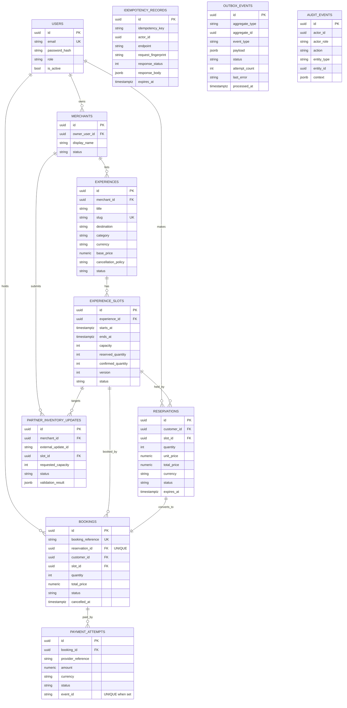

# Data Model

Independent educational portfolio project. Not affiliated with Klook.

All primary keys are UUIDs, all timestamps are `TIMESTAMPTZ` (UTC), and all money
is `NUMERIC(12,2)`. Schema is created/managed by Alembic
(`alembic/versions/…_initial_schema.py`).

## Entity–relationship diagram

## Constraints that enforce the invariants

| Constraint | Table | Guarantees |
|------------|-------|------------|
| `CHECK (capacity >= 0)` | experience_slots | Capacity non-negative |
| `CHECK (reserved_quantity >= 0)` | experience_slots | Reserved never negative (inv. 1) |
| `CHECK (confirmed_quantity >= 0)` | experience_slots | Confirmed never negative (inv. 2) |
| `CHECK (reserved + confirmed <= capacity)` | experience_slots | **No overselling** (inv. 3) |
| `CHECK (quantity > 0)` | reservations, bookings | Positive quantities |
| `UNIQUE (reservation_id)` | bookings | **One booking per reservation** (inv. 4) |
| `UNIQUE (booking_reference)` | bookings | Unique human reference |
| `UNIQUE (event_id) WHERE event_id IS NOT NULL` | payment_attempts | **Webhook applied once** (inv. 6) |
| `UNIQUE (idempotency_key, endpoint, actor_id)` | idempotency_records | **One key = one request** (inv. 5) |
| `UNIQUE (merchant_id, external_update_id)` | partner_inventory_updates | Idempotent partner sync |
| Foreign keys (`ON DELETE RESTRICT/CASCADE`) | all relations | Referential integrity |

## Indexes (beyond PKs/uniques)

- `ix_experiences_search (destination, category, status)` — search filter.
- `ix_experience_slots_experience_start (experience_id, starts_at)` — availability.
- `ix_reservations_status_expiry (status, expires_at)` — expiry worker scan.
- `ix_outbox_status_created (status, created_at)` — outbox worker poll.
- `ix_bookings_customer`, `ix_bookings_slot`, `ix_payment_attempts_booking`,
  `ix_audit_entity`, `ix_audit_created`.

The two most load-bearing invariants (no negative inventory; committed ≤ capacity)
are enforced by **PostgreSQL itself**, so they hold even if application code has a
bug — proven in `tests/integration/test_constraints.py`.
